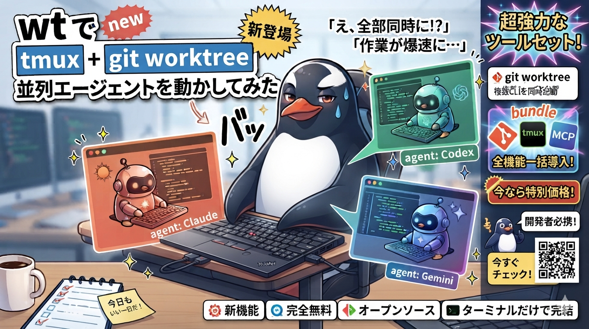

<div align="center">

# wt

**tmux + git worktrees for running coding agents in parallel.**



[](LICENSE)
&nbsp;

&nbsp;


**[Install](#install)** &nbsp;&bull;&nbsp;
**[Usage](#usage)** &nbsp;&bull;&nbsp;
**[Keybindings](#tmux-keybindings)** &nbsp;&bull;&nbsp;
**[MCP Profiles](#mcp-profiles)** &nbsp;&bull;&nbsp;
**[Example Setup](#example-setup)**

</div>

Each agent gets its own worktree and its own tmux session — agent and editor
side by side, with managed shells on demand — plus a live status you can see at a glance, so you always know
which one is working, which is waiting on you, and which is done.

It works with Claude, Codex, Gemini, opencode, and Pi: one session on Claude,
the next on Pi. The switcher lists whichever session you touched last first,
so the thing you're waiting on is never buried.

## What you get

- **A session per worktree.** `wt new` cuts the branch, adds the worktree, and
  opens a tmux session with the agent and editor side by side.
- **Persistent managed shells.** `prefix + c` creates named shells on demand;
  the CLI can run services, read output, send input, wait, and watch for failures.
- **Status at a glance.** Each session reports whether its agent is working,
  idle, waiting for input, or errored. `wt ls`, the fzf picker, and the tmux
  status bar all read the same live state.
- **PR badges.** `wt ls` and `wt pick` mark each worktree merged, open, draft, or
  closed, resolved from `gh` and cached.
- **Any agent, per session.** wt auto-detects which CLIs are installed and you
  choose one when you create the session.
- **Scoped MCP servers.** Worktree sessions get one set of MCP servers, the
  master session another, driven by profiles you keep in `~/.config/wt`.
- **Env files that follow the worktree.** A `.wt/sync` file copies or symlinks
  `.env` and friends into each new worktree, which git won't do for you.
- **Live diff in the editor.** nvim boots into a diffview of your branch against
  its base and refreshes as files change.
- **User-paced agent presentations.** Pi can walk through code and changes, ask
  code-grounded questions, or present trees and Markdown while nvim acts as a
  shared visual canvas.
- **A split master session** with a configurable TUI on the left and an agent
  with its own MCP profile on the right, for orchestrating work across the
  others.
- **Desktop notifications** when an agent needs your attention.

Runs on macOS and Linux.

## Install

```bash
git clone https://github.com/youruser/wt.git ~/src/wt
~/src/wt/install.sh
```

The installer will:
- Build the `wt-state` store binary (`state/` → `bin/wt-state`) and migrate any existing state
- Symlink scripts to `~/bin/`
- Set up tmux config at `~/.config/wt/tmux-wt.conf`
- Add tmux source line and status bar to `~/.tmux.conf`
- Merge hooks for detected agents:
  - Claude: `~/.claude/settings.json`
  - Gemini: `~/.gemini/settings.json`
  - Codex: `~/.codex/config.toml`
  - opencode: `~/.config/opencode/plugins/wt-status.js`
  - Pi: `~/.pi/agent/extensions/wt`
- Install the shared `wt-shells` Agent Skill for Claude, Codex, Gemini,
  OpenCode, and Pi using user-level skill symlinks

Requires: git, tmux, fzf, jq, go (to build `wt-state`), and at least one agent CLI ([Claude Code](https://github.com/anthropics/claude-code), [Codex](https://github.com/openai/codex), [Gemini CLI](https://github.com/google/gemini-cli), [opencode](https://opencode.ai/), or [Pi](https://pi.dev/))

Optional: [Neovim](https://neovim.io/) (editor and presentation canvas), [gh](https://cli.github.com/) (for PR lookup), [claudecode.nvim](https://github.com/anthropics/claudecode.nvim) (for Claude IDE integration), [Unified.nvim](https://github.com/axkirillov/unified.nvim) or [diffview.nvim](https://github.com/sindrets/diffview.nvim) + a file watcher ([watchexec](https://github.com/watchexec/watchexec), [entr](https://eradman.com/entrproject/), or `inotifywait`) for the live diff view

## Usage

```bash
# Session management
wt new                                # Interactive: pick repo, branch, agent
wt new ~/code feature-x              # Direct: create worktree (background)
wt new ~/code feature-x --switch      # Create and switch to it
wt new ~/code feature-x --agent codex # Use specific agent
wt new ~/code feature-y --agent pi    # Use Pi
wt pick                               # fzf picker (? to toggle preview)
wt switch <session>                   # Switch to a session (alias: s)
wt ls                                 # List sessions with status
wt delete <session>                   # Delete session and worktree (alias: rm)
wt delete-pick                        # Interactive delete picker (fzf)

# Agent control
wt agent <session> [task]             # Start agent on a task in a session (alias: claude)

# Master session
wt master                             # Create/attach master session
wt master --force                     # Replace existing master
wt master --agent gemini              # Master with specific agent

# PR integration
wt pr 42                              # Find session for PR #42
wt pr-pick                            # Interactive PR picker (fzf + gh)

# Status
wt status <session>                   # Print a session's status
wt sync-tmux                          # Restore tmux options after restart

# Managed shells (inside a worktree session)
wt shell new [name]                   # Interactive shell; create and switch
wt shell run server -- npm run dev    # Persistent command; don't steal focus
wt shell ls [--json]                  # List shells by stable name
wt shell open server                  # Switch to a shell
wt shell read server --lines 100      # Read recent persistent output
wt shell read server --new            # Read only output not read before
wt shell send server --key C-c        # Send a key or literal text
wt shell wait server --match Ready    # Wait for output, quiet, or exit
wt shell watch server --on error      # Queue matching output as an event
wt shell events --consume             # Read and clear queued events
```

## Mobile SSH interface

`wt mobile`, `wt pick`, and `prefix + s` use the same responsive session menu.
On a narrow terminal it becomes a phone-friendly 50/50 session-and-diff stack;
on a wider terminal it keeps the richer side preview. Selecting a row attaches
to that tmux session exactly as it is. Typing, terminal shortcuts, and mouse
events go directly to tmux without a capture-and-reply layer.

The portrait picker uses a 50/50 stack: the session menu is on top and the
selected session's Git diff is always visible below. Arrow keys navigate,
typing filters, Enter attaches, and `?` hides or shows the diff. This maps
directly to Termius on iOS gestures that emit arrow keys.

Mobile tmux clients get a directional fullscreen pane map. After the prefix,
`h`, `j`, `k`, or `l` selects the pane in that direction and zooms it to fill
the screen; `prefix + z` restores the split. A client-local marker applies this
map only to mobile clients, so desktop clients retain the normal wt bindings.
Tmux zoom itself is window-global, so simultaneous clients viewing the same
window see the same zoom state.

For voice prompts in Termius on iOS, switch the input selector above the
shortcut bar to **Paste** mode, tap the microphone on the iOS keyboard, then
send the completed text.

```bash
ssh -t devbox 'wt mobile'
```

To try the version in a checkout without installing it or touching existing wt
state, run the disposable demo harness:

```bash
./mobile-dev.sh

# From a phone (use the checkout's actual path on the host):
ssh -t devbox 'cd ~/src/wt && ./mobile-dev.sh'

# Remove its private tmux server, fake HOME, worktree, and state:
./mobile-dev.sh --clean
```

The harness stores everything below `/tmp/wt-mobile-dev-$USER`, uses a private
tmux socket and stub agents, and shadows Neovim. It neither replaces the
installed `wt` nor connects to live sessions. To test this checkout's UI against
your real sessions without installing it, run `./bin/wt mobile`; that command
does control the live sessions shown in your normal wt state.

The reusable commands beneath the UI are also available directly:

```bash
wt session list
wt session capture <session> --lines 100
printf '%s' 'reply text' | wt session send <session> --enter
wt session key <session> Escape
wt session diff <session> --files
```

## Managed Shells

Worktree sessions start with only the `main` window: Neovim on the left and the
selected agent on the right. Press `prefix + c` to create the first managed
shell when you need one. Further presses create `shell-2`, `shell-3`, and so on.
Outside a wt worktree session, `prefix + c` keeps its normal tmux behavior.

Managed shells are ordinary tmux windows, so native navigation (`prefix + n`,
`prefix + p`, and window indexes) still works. wt adds stable names and an API
that agents can use without relying on window numbers:

```bash
wt shell new scratch
wt shell run tests -- npm test -- --watch
wt shell pick
wt shell read tests --new
wt shell send tests --text r
wt shell send tests --key Enter
```

Shell output is logged privately beneath the configured `WT_STATUS_DIR` and is
removed with the owning worktree. Normal reads strip terminal control sequences
and commands sent through `wt shell`; use `read --raw` for the original terminal
stream. `read --new` advances a per-shell automation cursor. Watches are owned by
the tmux server, so they survive the agent tool call that created them, and they
record durable events without interrupting or waking the agent:

```bash
wt shell watch server --match 'Error|Exception'
wt shell watch tests --on exit-failure
wt shell events --json
wt shell unwatch server
```

Use `wt shell --session <session> ...` to address a worktree from another tmux
session, such as the master orchestrator.

### Agent skill

`install.sh` symlinks the repo-owned `wt-shells` skill into the supported global
skill locations:

```text
~/.agents/skills/wt-shells   # Codex + OpenCode + Pi
~/.claude/skills/wt-shells   # Claude
~/.gemini/skills/wt-shells   # Gemini
```

Agents discover the skill automatically when starting a new session (some
harnesses also detect it live). Invoke it explicitly as `$wt-shells`, or let an
agent load it when a task calls for a persistent server, watcher, REPL, debugger,
or log stream. The skill teaches agents to inspect existing shells before
starting duplicates and to keep one-shot commands in their native shell tool.

## Pi Integration

When Pi is installed, `install.sh` live-symlinks the bundled extension from
`config/pi-wt/` into `~/.pi/agent/extensions/wt`. The extension stays inert in
ordinary Pi sessions and activates only when `wt-agent-launch` exports a
`WT_SESSION` identity.

Pi lifecycle events update the same working, idle, and input states used by the
other agents. Its native session id is also captured, so `wt revive` resumes
the exact conversation with `pi --session <id>`.

The extension also registers one sequential `present` tool. Ask Pi to explain
existing code, walk through its changes, or present a project tree or Markdown
document. Each call sends a complete navigable deck to managed nvim: Pi provides
one or more scenes, each with a `file`, `diff`, `tree`, or `markdown` artifact,
and Neovim owns local slide navigation with `H`/`L` (or arrow keys). Generated
Markdown is Mermaid-first: agents are instructed to use fenced Mermaid diagrams
for architecture, workflows, sequences, state, dependencies, and other
relationships. User-installed Neovim plugins render those fences as Unicode in
the scratch buffer; without one, the standard Mermaid source remains readable.
The recommended setup is `render-markdown.nvim` plus
`render-markdown-mermaid.nvim` and its `bm` backend; see
[`config/pi-wt/README.md`](config/pi-wt/README.md#mermaid-rendering). `tree`
artifacts can use `view: "explorer"` for an actual `nvim-tree.nvim` file explorer
when available. The canvas restores the prior editor view when the presentation
ends; `/presentation-end` or `q` ends it explicitly. The versioned deck transport
(`wt-present`) is agent-neutral so other integrations can drive the same canvas
later. Presentations require nvim; diff scenes use Unified.nvim when available
and gracefully fall back to a normal file view.

Accurate settled status needs Pi 0.80.4 or newer; blocking extension-UI prompt
status needs Pi 0.84.4 or newer.

## Tmux Keybindings

| Key | Action |
|-----|--------|
| `prefix + c` | Create and open a managed shell inside a worktree session |
| `prefix + W` | Session switcher (fzf popup, most-recently-active first) |
| `prefix + w` | Action menu (new, switch, delete, PR, master) |
| `prefix + M` | Jump to master orchestrator session |

## Status Icons

| Icon | Status | Description |
|------|--------|-------------|
| `●` | working | Agent is actively using tools (green) |
| `○` | idle | Agent finished, session ready (blue) |
| `⊘` | input | Agent is waiting for your input (yellow) |
| `✗` | error | Agent encountered an error (red) |
| `◆` | master | Master orchestrator session |

## PR Badges

`wt ls` and `wt pick` show a PR-state badge per worktree, resolved via `gh` from
the session's branch and cached in the state store. Requires `gh` installed and
authenticated; sessions with no associated PR show no badge.

| Icon | State | Color |
|------|-------|-------|
| `⬤` | merged | magenta |
| `◆` | open | green |
| `◇` | draft | gray |
| `⊘` | closed (not merged) | red |

Cached badges stay fresh for `WT_PR_TTL` seconds (default 900) before wt
re-queries `gh`.

## MCP Profiles

Sessions get scoped MCP servers from wt profiles in `~/.config/wt/mcp-profiles/`:

- **Worktree sessions**: copies `~/.config/wt/mcp-profiles/default.json` into the worktree as `.mcp.json` if the repo does not already have one.
- **Master session**: copies `~/.config/wt/mcp-profiles/master.json` into `~/worktrees/.master/.mcp.json`.
- **OpenCode sessions**: also generate an OpenCode-native config at `~/.config/wt/opencode-mcp/<session>.json` and launch OpenCode with `OPENCODE_CONFIG` pointing at it.

OpenCode does not read `.mcp.json` directly. wt converts Claude-style `mcpServers` profiles to OpenCode's `mcp` schema, mapping remote servers from `type: "http"` to `type: "remote"` and local command servers to `type: "local"` with a command array.

Create profiles:
```bash
# Default profile (all worktree sessions)
cat > ~/.config/wt/mcp-profiles/default.json << 'EOF'
{ "mcpServers": { "my-server": { "type": "http", "url": "https://..." } } }
EOF

# Master profile (orchestrator session)
cat > ~/.config/wt/mcp-profiles/master.json << 'EOF'
{ "mcpServers": { "my-server": { "type": "http", "url": "https://..." } } }
EOF
```

For OpenCode, wt generates the equivalent runtime config:

```json
{
  "$schema": "https://opencode.ai/config.json",
  "mcp": {
    "my-server": {
      "type": "remote",
      "url": "https://..."
    }
  }
}
```

## Tool Permissions (Claude)

Seed every new worktree and master session with a default set of allowed tools
so Claude doesn't re-prompt for the same permissions in each session. Create
`~/.config/wt/claude-allowed-tools.json` as a JSON array of tool rules:

```json
["Read", "Edit", "Bash(npm run *)", "Bash(git status)"]
```

wt merges these into the session's `.claude/settings.local.json` on creation,
preserving any keys already present.

## Env File Sync

Worktrees don't inherit gitignored files like `.env`. Add a `.wt/sync` file to any repo to automatically copy or symlink env files into each new worktree on creation.

```
# .wt/sync
copy .env
copy .env.local
copy backend/.env
symlink webapp/.env
```

- `copy` copies the file out of the primary repo checkout, so each worktree gets its own isolated copy.
- `symlink` links back to the primary checkout, so the file stays in sync and edits affect the source.

Files missing from the primary repo are skipped with a warning, and files that already exist in the worktree are left untouched. `.wt/sync` holds no secrets, so it's safe to commit.

## Example Setup

One way to use the master session: point it at your customer-support queue and let it dispatch coding tasks to child worktrees. Here's how that setup fits together.

### MCP profiles

Remove all MCP servers from `~/.claude.json` (global config) so sessions only get what their profile provides:

```bash
# Clear global MCPs (keeps all other settings intact)
jq '.mcpServers = {}' ~/.claude.json > ~/.claude.json.tmp && mv ~/.claude.json.tmp ~/.claude.json
```

Child sessions get a code-tools MCP for code review and search:

```json
// ~/.config/wt/mcp-profiles/default.json
{
  "mcpServers": {
    "code-tools": {
      "type": "http",
      "url": "https://your-mcp-server.example.com/code-tools/mcp"
    }
  }
}
```

Master gets code-tools plus a customer support MCP:

```json
// ~/.config/wt/mcp-profiles/master.json
{
  "mcpServers": {
    "code-tools": {
      "type": "http",
      "url": "https://your-mcp-server.example.com/code-tools/mcp"
    },
    "support": {
      "type": "http",
      "url": "https://your-mcp-server.example.com/support/mcp"
    }
  }
}
```

### Master CLAUDE.md

The master session runs from `~/worktrees/.master/`. Place a `CLAUDE.md` there to give it context:

```markdown
# Master Orchestrator Session

You are the master orchestrator. Your jobs: manage worktree sessions and
handle customer support via the support MCP. Be concise.

## Dispatching Work

Create a worktree and send a task to the agent:
  wt new <repo> <branch> --start-agent --task "<task description>"

Workflow:
1. When work should be dispatched, ask the user what the task should be
2. Confirm the repo, branch name, and task description
3. Only dispatch after explicit approval
```

### Workflow

1. Open master: `wt master`
2. Master checks support queue via MCP, surfaces issues
3. You decide what needs a code fix: "create a session to fix the timeout bug in auth"
4. Master confirms: repo, branch name, task description
5. You approve, master runs: `wt new ~/workspace/myapp fix-auth-timeout --start-agent --task "Fix the 30s timeout..."`
6. Child session starts autonomously with full context
7. You monitor via `wt pick` or `prefix+W`

### Master TUI

The master session mirrors a worktree's `nvim | agent` layout. By default it
starts `linear-curses` on the left when that command is installed, with the master
agent on the right. The separate `shell` window remains available.

```bash
export WT_MASTER_TUI_CMD="linear-curses" # Any interactive terminal command
export WT_MASTER_TUI_WIDTH=50         # Percentage assigned to the left pane
export WT_MASTER_TUI_CWD="$HOME"      # Optional; defaults to the master workspace
```

Set `WT_MASTER_TUI_CMD=` to keep the legacy single-pane master. Because the TUI
and agent panes have semantic roles, session-control commands continue to
target the agent even if panes are reordered.

## Architecture

```
Agent hook/extension event
  ├── wt-hook writes session state via wt-state (SQLite: ~/.local/state/wt/wt.db)
  ├── wt-hook writes tmux @wt-* session options
  └── wt-hook calls tmux refresh-client -S (instant redraw)

wt-state → Go binary, authoritative SQLite session store (status, agent, PR
           state, timestamps); tmux options are a fast-read mirror for the UI

prefix+W → fzf popup (wt switch) lists live sessions, most-recently-active first
prefix+w → display-menu launches wt subcommands in popups
Status bar → wt-tmux-status aggregates status counts from wt-state
Pi present tool → wt-present → fixed nvim RPC API → shared presentation canvas
```

## Files

| Path | Purpose |
|------|---------|
| `bin/wt` | Main CLI |
| `bin/wt-hook` | Agent hook handler |
| `bin/wt-tmux-status` | Tmux status bar segment |
| `bin/wt-agent-launch` | Multi-agent launcher with per-agent logic |
| `bin/wt-bind-menu` | Builds the `prefix+w` action menu from live sessions |
| `bin/wt-diff-watch` | Watches the worktree and refreshes the nvim diff view |
| `bin/wt-present` | Agent-neutral JSON transport for the nvim presentation canvas |
| `bin/wt-state` | Go+SQLite session store (built from `state/`, gitignored) |
| `bin/claude-ide` | Backward-compat wrapper for wt-agent-launch |
| `state/` | `wt-state` Go source (SQLite store + migrations) |
| `config/tmux-wt.conf` | Tmux keybindings and hooks |
| `config/wt-menu.conf` | `prefix+w` action-menu definition |
| `config/wt-diff.lua` | nvim config for the live diffview |
| `config/wt-present.lua` | Extensible nvim presentation canvas and artifact renderers |
| `config/claude-hooks.json` | Claude Code hook configuration |
| `config/hooks-gemini.json` | Gemini CLI hook configuration |
| `config/opencode-wt-plugin.js` | opencode status plugin |
| `config/pi-wt/` | Pi status, native-session, and presentation extension |

## Environment Variables

| Variable | Default | Description |
|----------|---------|-------------|
| `WT_BASE_DIR` | `~/worktrees` | Base directory for worktrees |
| `WT_STATUS_DIR` | `~/.local/state/wt` | State directory (holds `wt.db`, logs, nvim sockets) |
| `WT_CONFIG_DIR` | `~/.config/wt` | Config directory (MCP profiles, allowed-tools) |
| `WT_DB` | `$WT_STATUS_DIR/wt.db` | Path to the SQLite state file |
| `WT_STATE` | `<bin>/wt-state` | Path to the `wt-state` binary |
| `WT_LOG_FILE` | `$WT_STATUS_DIR/wt.log` | Log file path |
| `WT_DEFAULT_AGENT` | `opencode` | Default agent CLI (opencode, claude, codex, gemini, pi) |
| `WT_MASTER_TUI_CMD` | `linear-curses` | Command for the master session's left pane; set empty to disable |
| `WT_MASTER_TUI_WIDTH` | `50` | Percentage of the master window assigned to the left TUI |
| `WT_MASTER_TUI_CWD` | `$WT_BASE_DIR/.master` | Working directory for the master TUI |
| `WT_DIFF_VIEW` | `1` | Boot session nvim into the live diffview.nvim diff; set `0` to disable |
| `WT_NVIM_SOCK_DIR` | `$WT_STATUS_DIR/nvim-sockets` | Where per-session nvim RPC sockets live |
| `WT_NVIM_SOCKET` | _(session option)_ | Override the nvim socket used by `wt-present` |
| `WT_PRESENT` | `wt-present` | Override the presentation transport used by the Pi extension |
| `WT_PRESENT_TIMEOUT_MS` | `15000` | Timeout for one Pi-to-nvim presentation operation |
| `WT_FZF_VIM` | `0` | Set `1` for vim-style modal keybindings in the fzf pickers |
| `WT_PR_TTL` | `900` | Seconds a cached PR badge stays fresh before re-querying `gh` |

## License

GPL-3.0
